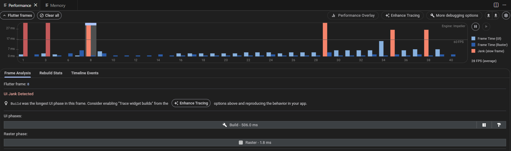
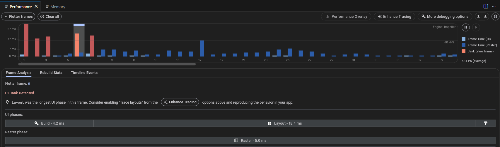
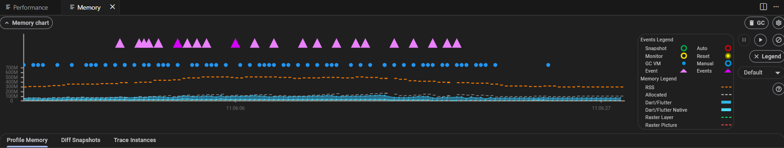
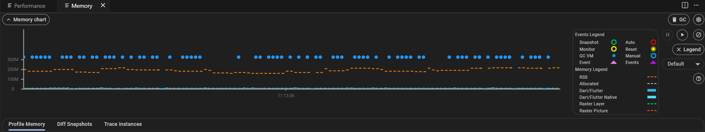

# Q1 — Flutter List Rendering Optimisation

This folder contains two runnable implementations of the same screen (1,000 network images):

- `naive/naive_img_loader`: intentionally non-optimised baseline
- `optimised/optimised_img_loader`: production-oriented implementation

## 1) Problems in the Naïve Version

The naïve screen uses `SingleChildScrollView` + `Column` to build all 1,000 `Image.network` widgets at once. This creates three major issues:

- **Heavy first frame cost**: Flutter must create, layout, and paint the full widget tree immediately, which blocks the UI thread and causes startup jank.
- **Unbounded network pressure**: many image requests are fired in a short time, wasting bandwidth and competing for device/network resources.
- **High memory usage and OOM risk**: images are decoded at full resolution and retained aggressively, which can spike heap usage on lower-end devices.

In short, this approach does not scale for large lists and is likely to produce dropped frames, delayed interactions, and occasional crashes.

## 2) Optimisations Applied (and Why)

The optimised version focuses on rendering only what is visible, reducing per-frame work, and controlling memory:

- **Lazy item creation with `ListView.builder`**: only visible rows (plus a small cache extent) are built, which keeps frame work proportional to viewport size instead of list size.
- **Tuned `cacheExtent` in `ListView.builder`**: preloads a controlled number of items just outside the viewport to reduce visible loading pops during scroll, without over-inflating memory usage.
- **Predictable layout via fixed `itemExtent`**: avoids expensive per-child size calculations during scrolling, improving scroll smoothness.
- **Image caching with `cached_network_image_ce`**: downloaded images are reused from cache, reducing repeated network fetches and improving perceived performance.
- **Decode-size control (`memCacheWidth` / `memCacheHeight`)**: images are downsampled closer to display size before being stored in memory, significantly reducing heap pressure.
- **Lightweight placeholders**: simple loading/error UI avoids expensive rebuild patterns while network fetches are in progress.

These choices mirror common production best practices for long, image-heavy feeds.

## 3) Profiling Notes (with Captured Assets)

Using Flutter DevTools Timeline + Memory view, the following captures were recorded from each approach.

### Performance (Build, Layout, Paint)

**Naïve approach**

**Optimised approach**

Comparison summary:

- **Build duration**: Naïve shows noticeably longer and more frequent spikes because many widgets are created up front; optimised keeps build work smaller and more consistent through lazy construction.
- **Layout duration**: Naïve has heavier layout cost due to large eager tree; optimised benefits from `ListView.builder` + fixed `itemExtent`, resulting in lower layout pressure.
- **Paint duration**: Naïve has larger paint bursts during initial render and aggressive scrolling; optimised is more stable with fewer large paint peaks.

### FPS Comparison

- **Naïve approach**: FPS drops are more frequent during initial load and fast scrolling, with visible stutter when frame times exceed the 16ms budget.
- **Optimised approach**: FPS remains much closer to target frame rate for longer periods, with fewer sustained dips during rapid scroll.
- **Profiling environment**: measurements were captured on an actual device (not emulator), and no raster jank issue was observed in the optimised implementation.

### Memory (Event Frequency)

**Naïve approach**

**Optimised approach**

Comparison summary:

- In the naïve approach, memory-related events occur **much more frequently** (allocation/GC churn is visibly higher).
- In the optimised approach, memory events are reduced and the graph is more stable due to lazy rendering + caching + downsampling.

## 4) Visual Comparison (WebM)

 

- Naïve recording:

https://github.com/user-attachments/assets/16470bf7-04b6-4d94-8bb3-a0a89ac73fd0

- Optimised recording:

https://github.com/user-attachments/assets/b51446b1-c74c-4a21-aa62-33acdd1facf6

These recordings show the runtime behavior difference during list navigation, where the optimised version maintains smoother interaction and more stable responsiveness.
